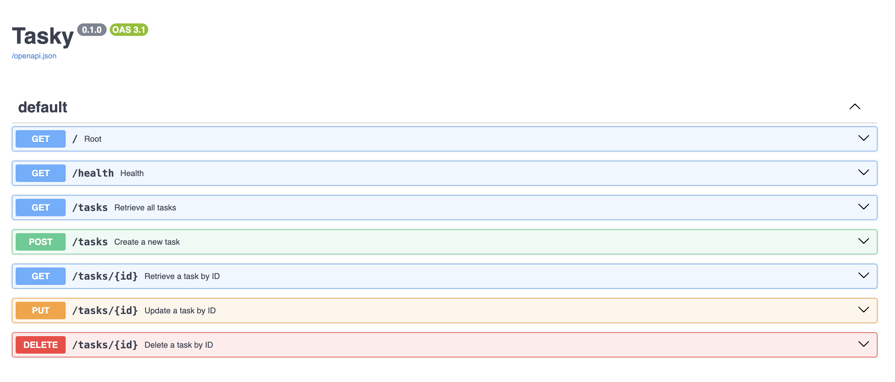
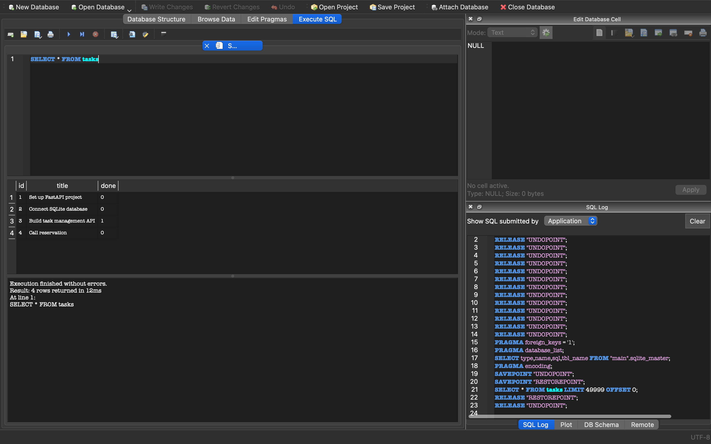

# Tasky

A small REST API for managing tasks, built with [FastAPI](https://fastapi.tiangolo.com/). Tasks are stored in memory (no database) and seeded with three sample items on startup. The app exposes CRUD endpoints for listing, creating, updating, and deleting tasks, plus a health check route.

## Install & run

From the `tasky/` directory:

```bash
python3 -m venv .venv && source .venv/bin/activate && pip install -r requirements.txt && uvicorn main:app --reload
```

The server listens at http://127.0.0.1:8000. Interactive API docs are at http://127.0.0.1:8000/docs.

## Endpoints

| Method | Path | Summary | Request body | Success response |
|--------|------|---------|--------------|------------------|
| `GET` | `/` | Service metadata | — | `200` — `{ "name", "version", "endpoints" }` |
| `GET` | `/health` | Health check | — | `200` — `{ "status": "ok" }` |
| `GET` | `/tasks` | List all tasks | — | `200` — array of tasks |
| `GET` | `/tasks/{id}` | Get task by ID | — | `200` — task object; `404` if not found |
| `POST` | `/tasks` | Create a task | `{ "title": string }` | `201` — new task; `400` if title missing |
| `PUT` | `/tasks/{id}` | Update a task | `{ "title"?: string, "done"?: bool }` | `200` — updated task; `404` if not found |
| `DELETE` | `/tasks/{id}` | Delete a task | — | `204` — deleted; `404` if not found |

Task object shape:

```json
{ "id": 1, "title": "Task 1", "done": false }
```

## Example request

```bash
curl -i -X POST http://localhost:8000/tasks -H "Content-Type: application/json" -d '{"title":"Buy coke"}'
```

```
HTTP/1.1 200 OK
date: Tue, 28 Jul 2026 17:45:07 GMT
server: uvicorn
content-length: 46
content-type: application/json

[{"id":4,"title":"Buy coke","done":false},201]
```

## Docs

Visit http://localhost:8000/docs to see the the docs




# AI vs me

## Full Prompt
You are a Python Software Engineer. 

Using python and fastAPI,  come up with 5 endpoints to perform the following operations:

* Get all tasks
* Get one task
* Create a task
* Update a task
* Delete a task


Note the following:

* For getting one task, deleting a task and updating a task, if the task id is not found, return a 404 status code and an object like so "{"error":"Task 6 not found"}".

* For creating a task, use the status code 201.
* For successfully deleting a task, return status code of 204
* When creating a task, if there is no title, return a status code of 400 and an object saying "{"error":"Title must have a value"}"
* Define a number of tasks somewhere up in the file so that getting tasks would have some initial data. Each task should have an id with value type as int, a title as string and a "done" key as either True or False
* Add a little description to each endpoint so that in the docs hosted on "/docs", each endpoint would have some description
* After creating all the endpoints, take a screenshot of the generated swagger docs at "/docs" and add it to the README
* Don't integrate any database


- Yes, it starts on the first trial
- Using curl on all endpoints, none fails

### What did the AI do better?
- I didn't specify the request type for the endpoints that needed requests like `POST /tasks`. AI did. So, my docs was missing the Request type format for the POST request, PUT request.
- AI was more elaborate in its implementation, using comments more, and adding descriptiions for the docs
- AI made use of the JSONResponse object, helping with a more unified response format
- AI defined the repeating "find" function and made reference to it where it's needed, making for cleaner code

### What did it get wrong or quietly ignore from your prompt?
Nothing. The Prompt was clear, specific and not 'toooo' long

### What did your prompt forget to specify — and what did the AI silently decide for you?
I forgot to specifiy other contents of the README, except for pasting the swagger screenshot. AI came up with a well documented README for me to run the server and to test each endpoint


# Connecting To The Database
### Why SQLite was chosen
- It is easily set up and configured
- It is light weight

### Where the database file is stored
The database file `tasks.db` is stored at the root of the `tasky` folder

### How to start the project
Reference the `Install & run` section at the top of this file

### A screenshot of your database viewer



### One example SQL query you executed
`SELECT * FROM tasks WHERE done  =  false`

# A3 — Containerize your stack

To start the Container

```bash
docker run --name postgres-container -e POSTGRES_PASSWORD=postgresPassword -d postgres
```

Show a running postgres container
```bash
docker ps
```

Open SQL prompt
```bash
docker exec -it postgres-container psql -U postgres -d postgres
```
